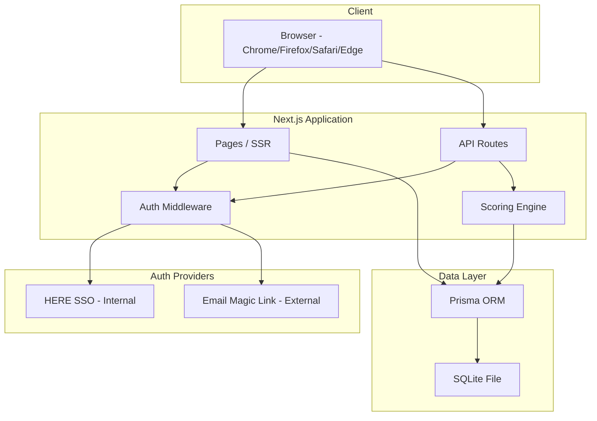
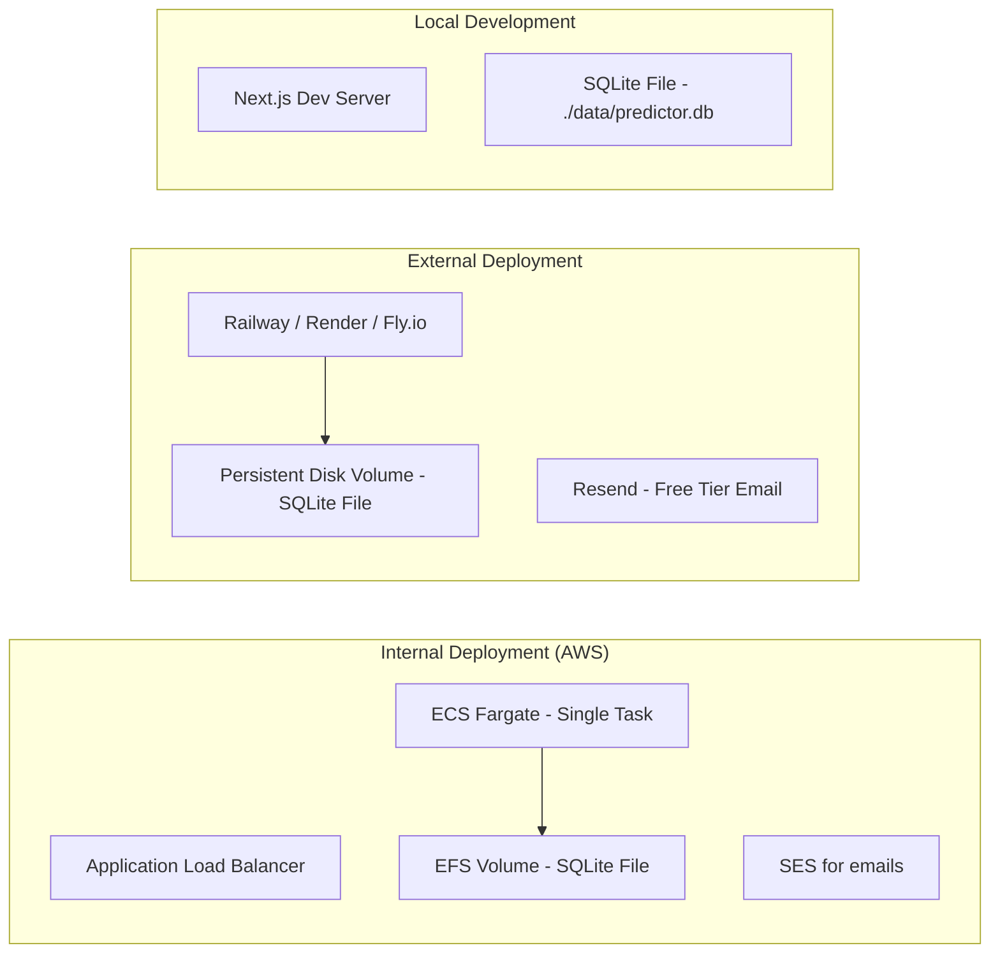
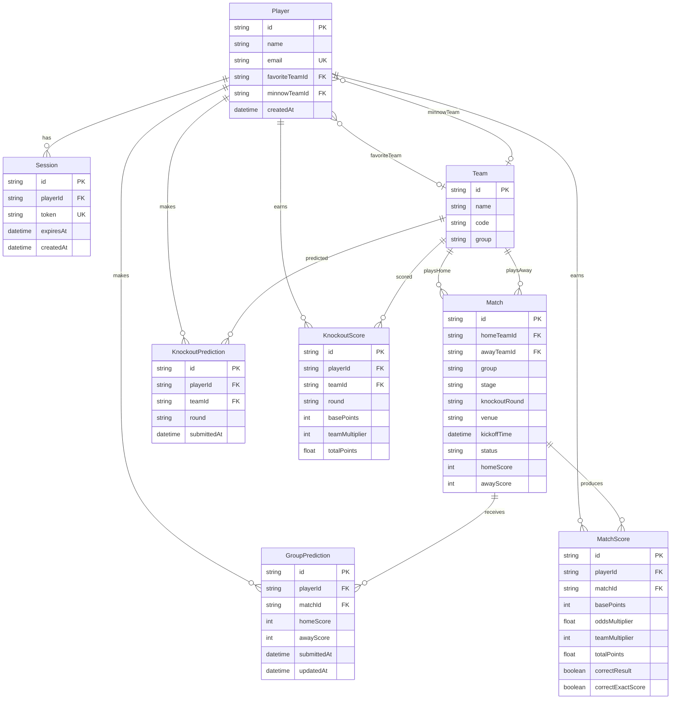

# Design Document

## Overview

The World Cup Predictor is a full-stack web application for small groups (20-50 players) to compete by predicting match outcomes during the FIFA World Cup. The system supports two deployment modes from a single codebase: an internal AWS deployment with HERE SSO authentication, and an external low-cost deployment with email-based magic link authentication.

The application consists of:
- A server-side rendered web application with a lightweight frontend
- A relational database for persistent storage
- An authentication layer that switches between SSO and email verification based on environment configuration
- A scoring engine that calculates points using base scores, odds multipliers, and team multipliers

### Key Design Decisions

1. **Next.js with TypeScript** — Provides server-side rendering, API routes, and a single deployable artifact. Well-suited for both AWS (via ECS Fargate) and low-cost platforms (Railway, Render, Fly.io).
2. **SQLite everywhere** — SQLite is used as the sole database across all environments (local, internal AWS, and external). It's a single file, requires no separate database server, and works identically across all environments. Only the file path changes via the `DATABASE_URL` environment variable (e.g., `file:./data/predictor.db` locally, `file:/mnt/efs/predictor.db` on AWS, `file:/data/predictor.db` on Railway). This eliminates database configuration drift between environments and simplifies deployment.
3. **Server-side rendering with minimal client JS** — The app is read-heavy with simple forms. SSR reduces complexity and improves performance for the 20-50 user scale.
4. **Environment-based configuration** — A single `.env` file controls deployment mode, auth provider, database URL, and feature flags.
5. **Single-instance constraint** — SQLite requires a single server instance (not serverless or multi-instance) to avoid write contention. This is perfectly adequate for 20-50 concurrent users and simplifies the deployment topology.

## Architecture



### Deployment Architecture



**Deployment details:**
- **Local**: SQLite file stored in the project folder at `./data/predictor.db`. Zero configuration needed.
- **Internal (AWS)**: Single ECS Fargate task with an EFS volume mount for the `.db` file at `/mnt/efs/predictor.db`. Single container instance — no multi-instance scaling needed for 50 users.
- **External**: Railway, Render, or Fly.io with a persistent disk volume for the `.db` file at `/data/predictor.db`. These platforms support persistent filesystem storage, unlike serverless platforms.

## Components and Interfaces

### 1. Authentication Module

Handles player registration and session management with provider switching.

```typescript
interface AuthConfig {
  provider: 'sso' | 'email';
  ssoClientId?: string;
  ssoClientSecret?: string;
  ssoIssuerUrl?: string;
  emailFromAddress?: string;
  emailServiceApiKey?: string;
  sessionDurationDays: number; // default: 7
  maxPlayers: number; // default: 50
}

interface AuthService {
  initiateLogin(email: string): Promise<LoginResult>;
  verifyCallback(token: string): Promise<Session>;
  getSession(sessionToken: string): Promise<Session | null>;
  logout(sessionToken: string): Promise<void>;
}

interface Session {
  id: string;
  playerId: string;
  playerName: string;
  expiresAt: Date;
}

interface LoginResult {
  type: 'redirect' | 'email_sent';
  redirectUrl?: string;
  message?: string;
}
```

### 2. Prediction Module

Manages group stage score predictions and knockout bracket predictions.

```typescript
interface PredictionService {
  // Group Stage
  submitGroupPrediction(playerId: string, matchId: string, homeScore: number, awayScore: number): Promise<PredictionResult>;
  getGroupPrediction(playerId: string, matchId: string): Promise<GroupPrediction | null>;
  getGroupPredictionsForMatch(matchId: string): Promise<GroupPrediction[]>;

  // Knockout Stage
  submitKnockoutPredictions(playerId: string, bracket: KnockoutBracket): Promise<PredictionResult>;
  getKnockoutPredictions(playerId: string): Promise<KnockoutBracket | null>;

  // Deadlines
  isGroupPredictionOpen(matchId: string): boolean;
  isKnockoutPredictionOpen(): boolean;
}

interface GroupPrediction {
  id: string;
  playerId: string;
  matchId: string;
  homeScore: number; // 0-20 integer
  awayScore: number; // 0-20 integer
  submittedAt: Date;
  updatedAt: Date;
}

interface KnockoutBracket {
  roundOf32: string[];    // 32 team IDs
  quarterFinals: string[]; // 8 team IDs
  semiFinals: string[];    // 4 team IDs
  thirdPlace: string;      // 1 team ID
  runnerUp: string;        // 1 team ID
  winner: string;          // 1 team ID
}

interface PredictionResult {
  success: boolean;
  message: string;
  prediction?: GroupPrediction | KnockoutBracket;
}
```

### 3. Scoring Engine

Calculates points based on match results, odds multipliers, and team multipliers.

```typescript
interface ScoringService {
  calculateMatchScores(matchId: string, actualHomeScore: number, actualAwayScore: number): Promise<MatchScoreResult[]>;
  calculateKnockoutScores(round: KnockoutRound, qualifiedTeams: string[]): Promise<KnockoutScoreResult[]>;
  getOddsMultipliers(matchId: string): OddsMultipliers;
  getPlayerTotalScore(playerId: string): Promise<number>;
}

interface MatchScoreResult {
  playerId: string;
  matchId: string;
  basePoints: number;         // 0, 1, or 4
  oddsMultiplier: number;     // 1.00 - 2.00
  teamMultiplier: number;     // 1, 2, or 4
  totalPoints: number;        // base × odds × team, rounded to 2dp
  correctResult: boolean;
  correctExactScore: boolean;
}

interface OddsMultipliers {
  homeWin: number;
  awayWin: number;
  draw: number;
}

type KnockoutRound = 'round_of_32' | 'quarter_finals' | 'semi_finals' | 'third_place' | 'runner_up' | 'winner';

interface KnockoutScoreResult {
  playerId: string;
  teamId: string;
  round: KnockoutRound;
  basePoints: number;       // 2, 3, 4, 5, 6, or 8
  teamMultiplier: number;   // 1, 2, or 4
  totalPoints: number;      // base × team multiplier
}
```

### 4. Team Selection Module

Manages favorite and minnow team selections with deadline enforcement.

```typescript
interface TeamSelectionService {
  selectFavoriteTeam(playerId: string, teamId: string): Promise<SelectionResult>;
  selectMinnowTeam(playerId: string, teamId: string): Promise<SelectionResult>;
  getPlayerSelections(playerId: string): Promise<TeamSelections>;
  getTeamMultiplier(playerId: string, matchId: string): number;
  isSelectionOpen(): boolean;
}

interface TeamSelections {
  favoriteTeamId: string | null;
  minnowTeamId: string | null;
}

interface SelectionResult {
  success: boolean;
  message: string;
}
```

### 5. Leaderboard Module

Aggregates scores and provides ranked player standings.

```typescript
interface LeaderboardService {
  getLeaderboard(): Promise<LeaderboardEntry[]>;
  getPlayerRank(playerId: string): Promise<number>;
}

interface LeaderboardEntry {
  rank: number;
  playerId: string;
  playerName: string;
  totalPoints: number;
  correctPredictions: number;  // count of predictions earning points
  exactScores: number;         // count of correct exact scores (tiebreaker)
}
```

### 6. Match Schedule Module

Manages the tournament schedule, match statuses, and time zone display.

```typescript
interface MatchService {
  getAllMatches(): Promise<Match[]>;
  getMatch(matchId: string): Promise<Match | null>;
  getMatchesByStage(stage: 'group' | 'knockout'): Promise<Match[]>;
  recordResult(matchId: string, homeScore: number, awayScore: number): Promise<void>;
}

interface Match {
  id: string;
  homeTeam: Team;
  awayTeam: Team;
  group?: string;              // e.g., "A", "B" — null for knockout
  stage: 'group' | 'knockout';
  knockoutRound?: KnockoutRound;
  venue: string;
  kickoffTime: Date;           // stored as UTC
  predictionDeadline: Date;    // kickoffTime - 2 hours
  status: 'upcoming' | 'in_progress' | 'completed';
  homeScore?: number;
  awayScore?: number;
}

interface Team {
  id: string;
  name: string;
  code: string;   // FIFA 3-letter code
  group: string;
}

// Time zone display helper
interface TimeZoneDisplay {
  eastern: string;  // US Eastern (ET)
  uk: string;       // UK (GMT/BST)
  ist: string;      // India Standard Time
}
```

## Data Models



### Prisma Schema (Key Models)

```prisma
model Player {
  id             String   @id @default(cuid())
  name           String
  email          String   @unique
  favoriteTeamId String?
  minnowTeamId   String?
  createdAt      DateTime @default(now())

  favoriteTeam      Team?              @relation("FavoriteTeam", fields: [favoriteTeamId], references: [id])
  minnowTeam        Team?              @relation("MinnowTeam", fields: [minnowTeamId], references: [id])
  sessions          Session[]
  groupPredictions  GroupPrediction[]
  knockoutPredictions KnockoutPrediction[]
  matchScores       MatchScore[]
  knockoutScores    KnockoutScore[]
}

model Match {
  id            String   @id @default(cuid())
  homeTeamId    String
  awayTeamId    String
  group         String?
  stage         String   // 'group' | 'knockout'
  knockoutRound String?
  venue         String
  kickoffTime   DateTime
  status        String   @default("upcoming")
  homeScore     Int?
  awayScore     Int?

  homeTeam         Team             @relation("HomeTeam", fields: [homeTeamId], references: [id])
  awayTeam         Team             @relation("AwayTeam", fields: [awayTeamId], references: [id])
  groupPredictions GroupPrediction[]
  matchScores      MatchScore[]
}

model GroupPrediction {
  id        String   @id @default(cuid())
  playerId  String
  matchId   String
  homeScore Int
  awayScore Int
  submittedAt DateTime @default(now())
  updatedAt   DateTime @updatedAt

  player Player @relation(fields: [playerId], references: [id])
  match  Match  @relation(fields: [matchId], references: [id])

  @@unique([playerId, matchId])
}

model MatchScore {
  id               String  @id @default(cuid())
  playerId         String
  matchId          String
  basePoints       Int
  oddsMultiplier   Float
  teamMultiplier   Int
  totalPoints      Float
  correctResult    Boolean
  correctExactScore Boolean

  player Player @relation(fields: [playerId], references: [id])
  match  Match  @relation(fields: [matchId], references: [id])

  @@unique([playerId, matchId])
}
```

## Correctness Properties

*A property is a characteristic or behavior that should hold true across all valid executions of a system — essentially, a formal statement about what the system should do. Properties serve as the bridge between human-readable specifications and machine-verifiable correctness guarantees.*

### Property 1: Scoring Formula Correctness

*For any* valid combination of base points (0, 1, or 4), odds multiplier (0.00–2.00), and team multiplier (1, 2, or 4), the calculated total points SHALL equal `round(basePoints × oddsMultiplier × teamMultiplier, 2)`.

**Validates: Requirements 3.4, 11.1**

### Property 2: Base Points Calculation

*For any* group stage match prediction and actual result pair:
- If the predicted score exactly matches the actual score, base points SHALL be 4 (1 for correct result + 3 for exact score)
- If the predicted outcome (home win / away win / draw) matches the actual outcome but scores differ, base points SHALL be 1
- Otherwise, base points SHALL be 0

**Validates: Requirements 3.1, 3.2, 3.3**

### Property 3: Odds Multiplier Calculation

*For any* set of group stage predictions for a match where total predictions > 0:
- For each outcome with at least one prediction, the odds multiplier SHALL equal `round(2 - (predictionsForOutcome / totalPredictions), 2)`
- For each outcome with zero predictions, the odds multiplier SHALL be 0
- All non-zero odds multipliers SHALL fall within the range [1.00, 2.00]

**Validates: Requirements 7.2, 7.3, 7.6, 7.7**

### Property 4: Team Multiplier Calculation

*For any* match and player with team selections:
- If neither team in the match is the player's favorite or minnow, team multiplier SHALL be 1
- If exactly one team in the match is the player's favorite XOR minnow (but not both roles), team multiplier SHALL be 2
- If a team in the match is both the player's favorite AND minnow (same team selected for both), team multiplier SHALL be 4
- If one team is the player's favorite and the other team is the player's minnow, team multiplier SHALL be 4

**Validates: Requirements 11.2, 11.3, 11.4, 11.5, 11.6, 5.5, 6.5, 6.7**

### Property 5: Knockout Round Scoring

*For any* knockout round and team that correctly advances to that round, the base points awarded SHALL follow the mapping: Round of 32 → 2, Quarter Finals → 3, Semi Finals → 4, Third Place → 5, Runner Up → 6, Winner → 8. The odds multiplier for knockout matches SHALL always be 1.00.

**Validates: Requirements 4.8, 4.9, 4.10, 4.11, 4.12, 4.13, 7.8**

### Property 6: Group Prediction Deadline Enforcement

*For any* match with kickoff time K and any timestamp T:
- If T < K - 2 hours, prediction submission SHALL be accepted
- If T ≥ K - 2 hours, prediction submission SHALL be rejected

**Validates: Requirements 2.4, 2.5**

### Property 7: Knockout Prediction Deadline Enforcement

*For any* timestamp T and the first match kickoff time F:
- If T < F, knockout prediction submission SHALL be accepted
- If T ≥ F, knockout prediction submission SHALL be rejected

**Validates: Requirements 4.4, 4.5**

### Property 8: Team Selection Deadline Enforcement

*For any* timestamp T and the first match kickoff time F:
- If T < F - 2 hours, team selection (favorite/minnow) SHALL be accepted
- If T ≥ F - 2 hours, team selection SHALL be rejected

**Validates: Requirements 5.2, 5.3, 6.2, 6.3**

### Property 9: Prediction Persistence Round-Trip

*For any* valid group stage prediction (player, match, homeScore 0-20, awayScore 0-20) submitted before the deadline, retrieving the prediction for that player and match SHALL return the most recently submitted scores.

**Validates: Requirements 2.2, 2.3**

### Property 10: Leaderboard Ordering

*For any* set of players with scores, the leaderboard SHALL be ordered such that:
- Players with higher total points appear before players with lower total points
- Among players with equal total points, those with more correct exact score predictions appear first
- Among players with equal total points AND equal exact scores, alphabetical order of name determines position

**Validates: Requirements 8.1, 8.4**

### Property 11: Time Zone Conversion

*For any* valid UTC timestamp, the displayed times SHALL correctly represent the same instant in US Eastern (America/New_York), UK (Europe/London), and India Standard Time (Asia/Kolkata) time zones, accounting for daylight saving transitions.

**Validates: Requirements 9.1**

### Property 12: Prediction Deadline Derivation

*For any* match with kickoff time K, the prediction deadline SHALL equal K minus exactly 2 hours.

**Validates: Requirements 9.3**

### Property 13: Match Status Derivation

*For any* match with kickoff time K, recorded result R, and current time T:
- If R exists (homeScore and awayScore are set), status SHALL be "completed"
- If T ≥ K and R does not exist, status SHALL be "in_progress"
- If T < K, status SHALL be "upcoming"

**Validates: Requirements 9.5**

### Property 14: Score Input Validation

*For any* score value V submitted as a prediction:
- If V is an integer and 0 ≤ V ≤ 20, the submission SHALL be accepted
- If V is not an integer OR V < 0 OR V > 20, the submission SHALL be rejected

**Validates: Requirements 2.7**

### Property 15: Single Team Selection Constraint

*For any* player and any sequence of favorite team selections, the player SHALL have exactly one (or zero) favorite team stored at any time — the most recent valid selection. The same constraint applies independently to minnow team selections.

**Validates: Requirements 5.1, 6.1**

## Error Handling

### Authentication Errors

| Error Condition | Handling Strategy |
|----------------|-------------------|
| SSO provider unavailable | Display "Authentication service temporarily unavailable" with retry option |
| Magic link expired (>15 min) | Display "Link expired" with option to request new link |
| Magic link already used | Display "Link already used" with option to request new link |
| Max players reached (50) | Display "Game is full" message, reject registration |
| Invalid session token | Redirect to login page |
| Session expired | Redirect to login page with "Session expired" message |

### Prediction Errors

| Error Condition | Handling Strategy |
|----------------|-------------------|
| Score out of range (not 0-20) | Client-side validation + server rejection with message |
| Non-integer score | Client-side validation + server rejection with message |
| Prediction after deadline | Display "Predictions closed" with deadline time shown |
| Knockout prediction after lock | Display "Bracket locked" message |
| Database write failure | Return 500 with "Unable to save prediction, please try again" |

### Scoring Errors

| Error Condition | Handling Strategy |
|----------------|-------------------|
| Match result recorded twice | Idempotent operation — recalculate and overwrite scores |
| Missing predictions for scoring | Award 0 points, skip player for that match |
| Division by zero in odds (0 total predictions) | No multipliers calculated — no one predicted, no one scores |

### General Errors

| Error Condition | Handling Strategy |
|----------------|-------------------|
| Database connection failure | Return 503 with "Service temporarily unavailable" |
| Unexpected server error | Log error details, return generic 500 message |
| Rate limiting (>10 requests/sec per user) | Return 429 with "Too many requests" |

## Testing Strategy

### Unit Tests

Unit tests cover specific examples, edge cases, and component behavior:

- **Scoring engine**: Specific score scenarios (e.g., predict 2-1, actual 2-1 → 4 base points)
- **Odds multiplier edge cases**: Single prediction, unanimous predictions, zero predictions for an outcome
- **Team multiplier edge cases**: Same team as both favorite and minnow, both teams in match selected
- **Deadline boundary**: Exact moment of deadline (millisecond precision)
- **Input validation**: Boundary values (0, 20, -1, 21, 1.5, NaN)
- **Leaderboard tiebreaker**: Players with identical points and exact scores
- **Auth flow**: Token generation, verification, expiry, single-use enforcement

### Property-Based Tests

Property-based tests verify universal correctness properties using randomized inputs. Each property test runs a minimum of 100 iterations.

**Library**: [fast-check](https://github.com/dubzzz/fast-check) (TypeScript property-based testing)

**Properties to implement**:

| Property | Tag |
|----------|-----|
| Scoring formula | Feature: world-cup-predictor, Property 1: Scoring formula correctness |
| Base points calculation | Feature: world-cup-predictor, Property 2: Base points calculation |
| Odds multiplier calculation | Feature: world-cup-predictor, Property 3: Odds multiplier calculation |
| Team multiplier calculation | Feature: world-cup-predictor, Property 4: Team multiplier calculation |
| Knockout round scoring | Feature: world-cup-predictor, Property 5: Knockout round scoring |
| Group prediction deadline | Feature: world-cup-predictor, Property 6: Group prediction deadline enforcement |
| Knockout prediction deadline | Feature: world-cup-predictor, Property 7: Knockout prediction deadline enforcement |
| Team selection deadline | Feature: world-cup-predictor, Property 8: Team selection deadline enforcement |
| Prediction persistence | Feature: world-cup-predictor, Property 9: Prediction persistence round-trip |
| Leaderboard ordering | Feature: world-cup-predictor, Property 10: Leaderboard ordering |
| Time zone conversion | Feature: world-cup-predictor, Property 11: Time zone conversion |
| Prediction deadline derivation | Feature: world-cup-predictor, Property 12: Prediction deadline derivation |
| Match status derivation | Feature: world-cup-predictor, Property 13: Match status derivation |
| Score input validation | Feature: world-cup-predictor, Property 14: Score input validation |
| Single team selection | Feature: world-cup-predictor, Property 15: Single team selection constraint |

**Configuration**: Each property test must run with `numRuns: 100` minimum.

### Integration Tests

- **Auth flow end-to-end**: SSO redirect/callback, magic link send/verify
- **Prediction submission**: Full request cycle through API to database
- **Score calculation trigger**: Match result entry → score calculation → leaderboard update
- **Deployment modes**: Verify both internal and external configs boot correctly with SQLite (same engine, different file paths via `DATABASE_URL`)
- **Data persistence**: Verify data survives application restart

### End-to-End Tests

- **Player journey**: Register → select teams → predict group matches → predict bracket → view leaderboard
- **Admin journey**: Record match results → verify scores calculated → verify leaderboard updated
- **Deadline enforcement**: Attempt predictions at various times relative to deadlines
- **Browser compatibility**: Smoke tests on Chrome, Firefox, Safari, Edge (latest 2 versions)

